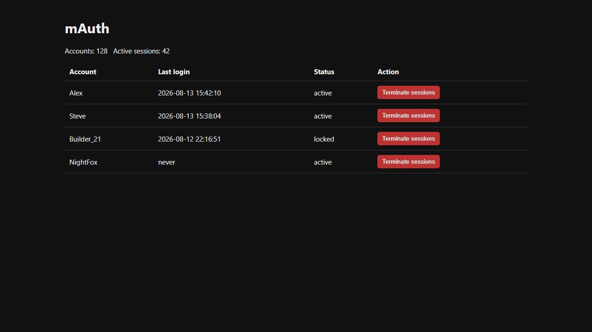

<div align="center">
  <h1>mAuth</h1>
  <p>Account authentication for offline-mode and mixed-mode Minecraft networks.</p>

  <p>
    <a href="https://papermc.io/software/paper"></a>
    <a href="https://purpurmc.org"></a>
    <a href="https://papermc.io/software/folia"></a>
    <a href="https://papermc.io/software/velocity"></a>
  </p>

  <p>
    <a href="https://github.com/miklires/mAuth"></a>
    <a href="https://modrinth.com/project/mauth"></a>
  </p>

  <p>
    <a href="https://bstats.org/plugin/bukkit/mAuth/33343"></a>
    <a href="https://github.com/miklires/mAuth/releases/latest"></a>
    
  </p>
</div>

Password login, premium and Floodgate accounts, TOTP, recovery, active sessions, legacy imports, and proxy routing are included without requiring an external database. Discord, Telegram, and Velocity are separate addons.

## What it does

- Argon2id passwords with migration from bcrypt and common AuthMe-style hashes
- H2, SQLite, MySQL, MariaDB, and PostgreSQL storage with schema upgrades
- premium accounts through Velocity and Bedrock autologin through Floodgate
- TOTP, recovery codes, verified email recovery, sessions, and account locks
- login captcha, connection flood handling, IP limits, shared-IP session protection, nickname filters, and VPN providers
- separate login/registration deadlines with a localized countdown boss bar
- duplicate-session protection and reliable save/restore around the built-in limbo world
- account imports from AuthMe, nLogin, LibreLogin, and OpeNLogin
- a protected local web panel, PlaceholderAPI values, audit history, and bStats

## Requirements

- Java 25
- Paper-compatible server 26.2
- Velocity only when using the proxy addon

## Install

1. Put `mAuth-1.0.1.jar` in the backend server `plugins` directory.
2. Start the server once and edit `plugins/mAuth/config.yml`.
3. Add optional addon jars beside the core jar.
4. For proxy mode, set the same `shared-secret` on the proxy and backend.

H2 is the default storage. Discord, Telegram, email, VPN lookup, and the web panel stay disabled until configured. bStats and update checks can be disabled separately.

## Configuration

- `security`: password hashing, separate login/registration timeouts, bossbar, login limits, TOTP encryption, sessions, duplicate-session protection, and new IP or device handling
- `storage`: database type, local file, pool settings, or a complete JDBC URL override
- `discord`, `telegram`, and `email`: account linking, verification, notifications, and recovery
- `proxy.shared-secret`: signed synchronization with the Velocity addon
- `vpn` and `geoip`: risk provider, location database, caching, and fail-open or fail-closed behavior
- `web`: bind address, port, and generated Basic authentication token
- `metrics.bstats-id` and `updates.modrinth-project-id`: optional metrics and update discovery

Config files carry a version number. Missing settings are added when mAuth upgrades an older config. Player messages live in `lang/en_US.yml` and `lang/ru_RU.yml`; another locale file can be selected with `language.default`.

Do not expose the web panel to the public Internet without a trusted reverse proxy and TLS. Keep bot tokens, SMTP credentials, the proxy secret, and `security.data-encryption-key` private.

## Web panel

The protected panel lists accounts and active sessions and lets an administrator terminate every session for an account.



## Artifacts

- `mAuth-1.0.1.jar`: Paper, Purpur, and Folia core
- `mAuth-API-1.0.1.jar`: public interfaces and authentication event
- `mAuth-Velocity-1.0.1.jar`: Velocity login routing and mixed-mode support
- `mAuth-Discord-1.0.1.jar`: Discord linking and recovery
- `mAuth-Telegram-1.0.1.jar`: Telegram linking and recovery

## Player commands

`/register`, `/login`, `/logout`, `/changepassword`, `/premium`, `/cracked`, `/2fa`, `/sessions`, `/email`, `/recover`, and `/telegram` are registered through the Paper Commands API. Incomplete commands are handled by mAuth and show localized usage instead of the server's generic syntax error.

## Administration

`/mauth` provides reload, import, force-login, account lock, and Discord history operations. `/mauthreset`, `/mauthunlink`, `/mauthlog`, and `/mauthip` are owner-facing account tools. Full IP addresses are only exposed through the protected IP-history permission.

## PlaceholderAPI

When PlaceholderAPI is installed, mAuth registers `%mauth_authenticated%`, `%mauth_status%`, and `%mauth_version%`.

## Telemetry and updates

mAuth uses [bStats plugin ID 33343](https://bstats.org/plugin/bukkit/mAuth/33343) for anonymous usage statistics. Disable collection with `metrics.enabled: false`. The update checker reads the public Modrinth project and can be disabled independently with `updates.enabled: false`.

## Build

```bash
./gradlew clean build :api:build :discord:build :velocity:build :telegram:build
```

The project is licensed under the MIT License.
